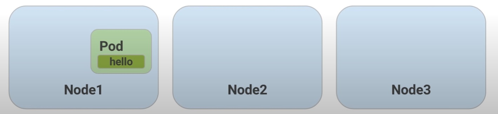
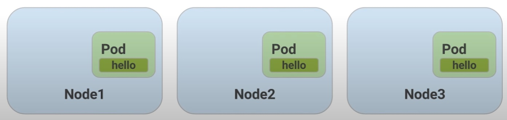
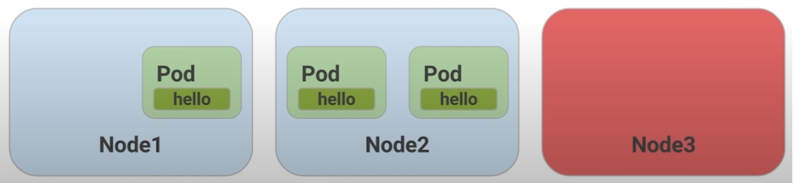
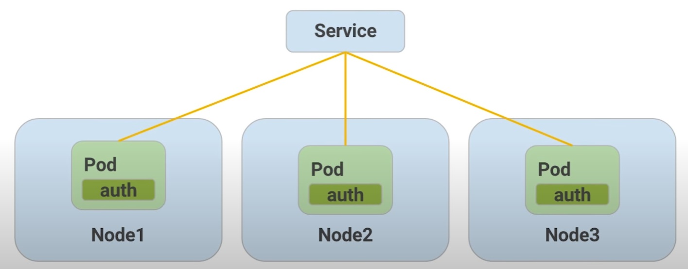
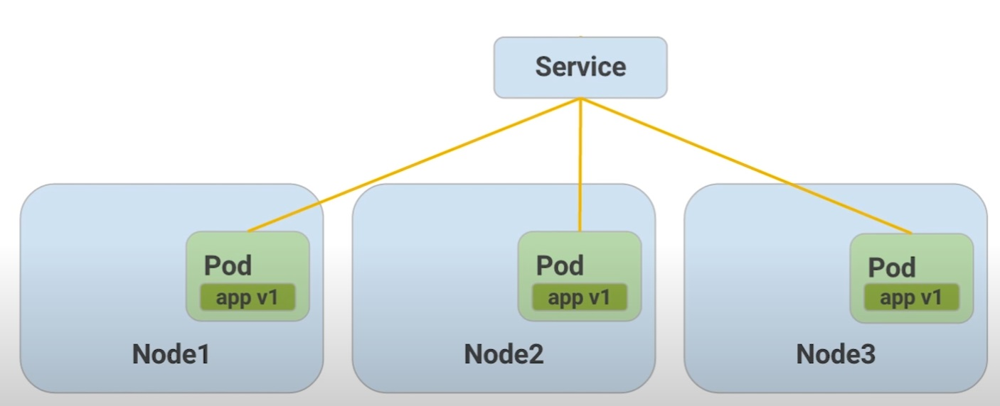
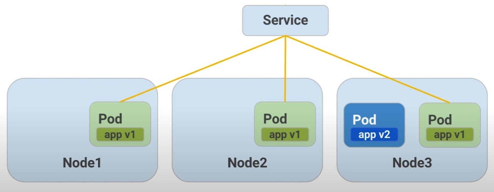
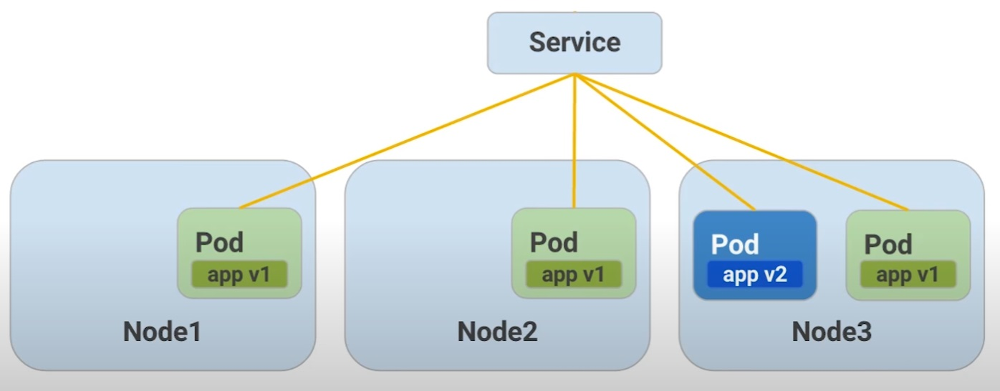
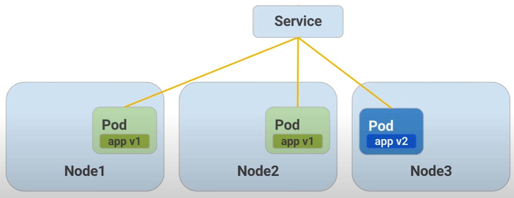

# Scalable Microservices with Kubernetes

In this course you will learn how to:

- Provision a complete Kubernetes using Google Container Engine
- Deploy and manage Docker containers using kubectl

Kubernetes Version: 1.2.2

## Course Description
Kubernetes is all about applications and in this course you will utilize the Kubernetes API to deploy, manage, and upgrade applications. In this part of the workshop you will use an example application called "app" to complete the labs.

## Setup GCE and Enable Cloud Shell

### Create a Project
Create a new project or use and existing project 
[Creating and managing projects](https://cloud.google.com/resource-manager/docs/creating-managing-projects?visit_id=638332545978322259-4149601563&rd=1)

### Enable Compute Engine and Container Engine APIs
[Introducing the Google API Console](https://developers.googleblog.com/2016/03/introducing-google-api-console.html)

- Compute Engine API
- Container Engine API

### Enable Cloud Shell
[Cloud Shell documentation](https://cloud.google.com/shell/docs)

#### Configure Your Cloud Shell Environment
Create two Cloud Shell Sessions and run the following commands to avoid setting the compute zone.

List available time zones:

`gcloud compute zones list`

Set a time zone example:

`gcloud config set compute/zone europe-west1-d`

#### Download Go
Cloud Shell comes with an installed Go, but it's not the most recent version, so you should perform the steps below to install the latest Go and set GOPATH.

```bash
wget https://storage.googleapis.com/golang/go1.6.2.linux-amd64.tar.gz
sudo rm -rf /usr/local/go
sudo tar -C /usr/local -xzf go1.6.2.linux-amd64.tar.gz
echo "export GOPATH=~/go" >> ~/.bashrc
source ~/.bashrc
```

Get the code:

```bash
mkdir -p $GOPATH/src/github.com/udacity
cd $GOPATH/src/github.com/udacity
git clone https://github.com/udacity/ud615
```

Change to app directory:

`cd ud615/app`

### Build and Interact with Monolith

On shell 1 - build the app
Make sure you are in the app directory and build the app:

```bash
cd $GOPATH/src/github.com/udacity/ud615/app
mkdir bin
go build -o ./bin/monolith ./monolith
```

Optional - if you run into errors building your go binaries, you probably need to install the dependencies first by running:

`go get -u`

On shell 1 - run the monolith server:

`sudo ./bin/monolith -http :10080`

On shell 2 - test the app:

```bash
curl http://127.0.0.1:10080
curl http://127.0.0.1:10080/secure
```
On shell 2 - authenticate (password is `password`):

`curl http://127.0.0.1:10080/login -u user`

It prints out the token.

On shell 2 - login and assign the value of the JWT to a variable

`TOKEN=$(curl http://127.0.0.1:10080/login -u user | jq -r '.token')`

Check that it worked:

`echo $TOKEN`

On shell 2 - access the secure endpoint using the JWT:

`curl -H "Authorization: Bearer $TOKEN" http://127.0.0.1:10080/secure`

On shell 2 - check out dependencies

```bash
cd ~/go/src/github.com/udacity/ud615/app
ls vendor 
cat vendor/vendor.json
```

### Refactor to Microservice Architecture
Shell 1 - build and run the hello service

```bash
go build -o ./bin/hello ./hello
sudo ./bin/hello -http 0.0.0.0:10082
```

Shell 2 - build and run the auth service

```bash
go build -o ./bin/auth ./auth
sudo ./bin/auth -http :10090 -health :10091
```

Shell 3 - interact with the auth and hello microservices

```bash
TOKEN=$(curl 127.0.0.1:10090/login -u user | jq -r '.token')
curl -H "Authorization:  Bearer $TOKEN" http://127.0.0.1:10082/secure
```

## Installing apps with native OS tools

Cloud shell - set compute/zone

Note - Google Cloud shell is an ephemeral instance and will reset if you don't use it for more than 30 minutes. That is why you might have to set some configuration values again

```bash
gcloud compute zones list
gcloud config set compute/zone <zone>
```

Cloud shell - launch a new VM instance
```bash
gcloud compute instances create ubuntu \
--image-project ubuntu-os-cloud \
--image ubuntu-1604-xenial-v20160420c 
```

Cloud shell - log into the VM instance
`gcloud compute ssh ubuntu`

VM instance - update packages and install nginx

```bash
sudo apt-get update
sudo apt-get install nginx
nginx -v
```

VM instance - start nginx

`sudo systemctl start nginx`

Check that it's running

```bash
sudo systemctl status nginx

curl http://127.0.0.1
```

## Problem! How to install two versions

Installing and running two versions of nginx on a native OS can be done, but is not straightforward.  

VM instance
Install nginx again

`sudo apt-get install nginx`

Start nginx again and check nginx status

```bash
sudo systemctl start nginx
sudo systemctl status nginx
sudo ps aux | grep nginx
```

Check nginx config file
`cat /etc/init/nginx.conf`

Stop nginx
`sudo systemctl stop nginx`

## Container Overview

- [What are containers and why do you need them?](https://www.cio.com/article/247005/what-are-containers-and-why-do-you-need-them.html)
- [Containers bring a skinny new world of virtualization to Linux](https://www.computerworld.com/article/2698646/containers-bring-a-skinny-new-world-of-virtualization-to-linux.html)

## Installing Images with Docker

Commands to run (on the VM Instance)

Install Docker

`sudo apt-get install docker.io`

Check Docker images

`sudo docker images`

Pull nginx image

```bash
sudo docker pull nginx:1.10.0
sudo docker images
```

Verify the versions match

`sudo dpkg -l | grep nginx`

If your version of nginx from native package and Docker are different, you need to update the VM instance:

```bash
sudo apt-get update
sudo apt-get install nginx
```

## Running Images with Docker

Commands to run on the VM Instance

Run the first instance

`sudo docker run -d nginx:1.10.0`

Check if it's up

`sudo docker ps`

Run a different version of nginx

`sudo docker run -d nginx:1.9.3`

Run another version of nginx

`sudo docker run -d nginx:1.10.0`

Check how many instances are running

`sudo docker ps`

Output:
```bash
$ sudo docker ps
CONTAINER ID        IMAGE               COMMAND                  CREATED              STATUS              PORTS               NAMES
10408d8f4e7c        nginx:1.10.0        "nginx -g 'daemon of…"   6 seconds ago        Up 6 seconds        80/tcp, 443/tcp     goofy_wozniak
2804e12fcb42        nginx:1.9.3         "nginx -g 'daemon of…"   About a minute ago   Up About a minute   80/tcp, 443/tcp     nifty_cartwright
68b3539175f9        nginx:1.10.0        "nginx -g 'daemon of…"   2 minutes ago        Up 2 minutes        80/tcp, 443/tcp     loving_pike
```

`sudo ps aux | grep nginx`

Output:
```bash
$ sudo ps aux | grep nginx
root      7499  0.0  0.1  31684  5148 ?        Ss   21:13   0:00 nginx: master process nginx -g daemon off;
syslog    7537  0.0  0.0  32068  2948 ?        S    21:13   0:00 nginx: worker process
root      7781  0.0  0.1  31500  4908 ?        Ss   21:14   0:00 nginx: master process nginx -g daemon off;
syslog    7824  0.0  0.0  31876  2740 ?        S    21:14   0:00 nginx: worker process
root      8002  0.0  0.1  31684  5148 ?        Ss   21:15   0:00 nginx: master process nginx -g daemon off;
syslog    8037  0.0  0.0  32068  2872 ?        S    21:15   0:00 nginx: worker process
cubin_p+  8076  0.0  0.0  12948   976 pts/0    S+   21:16   0:00 grep --color=auto nginx
```

What's with the container names?

If you don't specify a name, Docker gives a container a random name, such as "stoic_williams," "sharp_bartik," "awesome_murdock," or "evil_hawking." (Stephen Hawking got no love on this one.)

These are generated from a list of adjectives and names of famous scientists and hackers. The combination of the names and adjectives is random, except for one case. Want to see what the exception is? 

[Check it out in the Docker source code](https://github.com/moby/moby/blob/master/pkg/namesgenerator/names-generator.go)


## Talking to Docker instances

List all running container processes

`sudo docker ps`

Output:
```bash
$ sudo docker ps
CONTAINER ID        IMAGE               COMMAND                  CREATED              STATUS              PORTS               NAMES
10408d8f4e7c        nginx:1.10.0        "nginx -g 'daemon of…"   6 seconds ago        Up 6 seconds        80/tcp, 443/tcp     goofy_wozniak
2804e12fcb42        nginx:1.9.3         "nginx -g 'daemon of…"   About a minute ago   Up About a minute   80/tcp, 443/tcp     nifty_cartwright
68b3539175f9        nginx:1.10.0        "nginx -g 'daemon of…"   2 minutes ago        Up 2 minutes        80/tcp, 443/tcp     loving_pike
```

For use in shell scripts you might want to just get a list of container IDs (-a stands for all instances, not just running, and -q is for "quiet" - show just the numeric ID):

`sudo docker ps -aq`

Output:

```bash
$ sudo docker ps -aq
10408d8f4e7c
2804e12fcb42
68b3539175f9
```

Inspect the container

You can use either CONTAINER ID or NAMES field, from the above output:

You can use either of the following commands:

```bash
sudo docker inspect 10408d8f4e7c
or
sudo docker inspect goofy_wozniak
```

Connect to the nginx using the internal IP

Get the internal IP address either copying from the full inspect file or by assigning it to a shell variable:

```bash
CN="goofy_wozniak"
CIP=$(sudo docker inspect --format '{{ .NetworkSettings.IPAddress }}' $CN)
curl  http://$CIP
```

You can also get all instance IDs and their corresponding IP addresses by doing this:

`sudo docker inspect -f '{{.Name}} - {{.NetworkSettings.IPAddress }}' $(sudo docker ps -aq)`

Output:

```bash
$ sudo docker inspect -f '{{.Name}} - {{.NetworkSettings.IPAddress }}' $(sudo docker ps -aq)
/goofy_wozniak - 172.17.0.4
/nifty_cartwright - 172.17.0.3
/loving_pike - 172.17.0.2
```

Stop an instance

`sudo docker stop <cid>`

or 

`sudo docker stop $(sudo docker ps -aq)`

Verify no more instances running

`sudo docker ps`

Remove the docker containers from the system

`sudo docker rm <cid>`

or

`sudo docker rm $(sudo docker ps -aq)`

## Creating your own images overview

Dockerfiles contain step-by-step instructions for creating Docker images.

Commands to run on the VM Instance

Install Go
```bash
wget https://storage.googleapis.com/golang/go1.6.2.linux-amd64.tar.gz
rm -rf /usr/local/bin/go
sudo tar -C /usr/local -xzf go1.6.2.linux-amd64.tar.gz
export PATH=$PATH:/usr/local/go/bin
export GOPATH=~/go
```

Get the app code

```bash
mkdir -p $GOPATH/src/github.com/udacity
cd $GOPATH/src/github.com/udacity
git clone https://github.com/udacity/ud615.git
```

Build a static binary of the monolith app

```bash
cd ud615/app/monolith
go get -u
go build --tags netgo --ldflags '-extldflags "-lm -lstdc++ -static"'
```

You have to explicitly make the binary static. This is really important in the Docker community right now because alpine has a different implementation of libc. So your go binary wouldn't have had the lib it needed if it wasn't static. You created a static binary so that your application could be self-contained.

Create a container for the app

Look at the Dockerfile

`cat Dockerfile`

Output:

```bash
$ cat Dockerfile
FROM alpine:3.1
MAINTAINER Kelsey Hightower <kelsey.hightower@gmail.com>
ADD monolith /usr/bin/monolith
ENTRYPOINT ["monolith"]
```

Build the app container

`sudo docker build -t monolith:1.0.0 .`

List the monolith image

`sudo docker images monolith:1.0.0`

Run the monolith container and get it's IP

```bash
sudo docker run -d monolith:1.0.0
sudo docker inspect <container name or cid>
```

or 

```bash
CID=$(sudo docker run -d monolith:1.0.0)
CIP=$(sudo docker inspect --format '{{ .NetworkSettings.IPAddress }}' ${CID})
```

Test the container

`curl <the container IP>`
 
 or

`curl $CIP`

Important note on security

If you are tired of typing "sudo" in front of all Docker commands, and confused why a lot of examples don't have that, please read the following article about implications on security 
[Why we don't let non-root users run Docker in CentOS, Fedora, or RHEL](https://projectatomic.io/blog/2015/08/why-we-dont-let-non-root-users-run-docker-in-centos-fedora-or-rhel/)


## Create the Other Containers

Create docker images for the remaining microservices - auth and hello.
Repeat the steps you took for monolith.

Build the auth app

```bash
cd $GOPATH/src/github.com/udacity/ud615/app
cd auth
go build --tags netgo --ldflags '-extldflags "-lm -lstdc++ -static"'
sudo docker build -t auth:1.0.0 .
CID2=$(sudo docker run -d auth:1.0.0)
```

Build the hello app

```bash
cd $GOPATH/src/github.com/udacity/ud615/app
cd hello
go build --tags netgo --ldflags '-extldflags "-lm -lstdc++ -static"'
sudo docker build -t hello:1.0.0 .
CID3=$(sudo docker run -d hello:1.0.0)
```

See the running containers
`sudo docker ps -a`

## Public vs Private Registries
A lot of the power of container images stems from the ability to host and download them from cloud registries. This makes it easy to share containers without having to use complex pipelines for distributing them.

When it comes to registries there are a few options. Below are a few different registries.

### Docker Hub
Docker Hub is the registry we’re using in this class. Go ahead and sign up for docker hub and create a repository so that you can follow along with the remaining lessons: 

[Docker Hub](https://hub.docker.com/)

### Quay
Quay is another popular registry because of it’s rich automated workflow for building containers from github. 

[Quay](https://quay.io/)

### Google Cloud Registry
Finally, Google Cloud Registry (GCR) is a strong option for large enterprises. 

[Google Cloud Registry](https://cloud.google.com/container-registry/docs/)

### Comparison of 4 registries
A write up comparing some of the different registries

[Comparing Four Hosted Docker Registries](https://www.suse.com/c/rancher_blog/comparing-four-hosted-docker-registries/)

## Push Images

See all images

`sudo docker images`

Output:

```bash
$ sudo docker images
REPOSITORY          TAG                 IMAGE ID            CREATED             SIZE
hello               1.0.0               27173b19289c        13 minutes ago      13.3MB
auth                1.0.0               32556385393e        14 minutes ago      13.3MB
monolith            1.0.0               42966dd98011        2 hours ago         13.4MB
alpine              3.1                 a1038a41fe2b        4 years ago         5.05MB
nginx               1.10.0              16666ff3a57f        7 years ago         183MB
nginx               1.9.3               ea4b88a656c9        8 years ago         133MB
```

Docker tag command help

`docker tag --help`

Output:

```bash
$ docker tag --help

Usage:  docker tag SOURCE_IMAGE[:TAG] TARGET_IMAGE[:TAG]

Create a tag TARGET_IMAGE that refers to SOURCE_IMAGE
```

Add your own tag

`sudo docker tag monolith:1.0.0 <your username>/monolith:1.0.0`

Check the tag was applied:

`sudo docker images`

Output:

```bash
$ sudo docker images
REPOSITORY             TAG                 IMAGE ID            CREATED             SIZE
hello                  1.0.0               27173b19289c        19 minutes ago      13.3MB
auth                   1.0.0               32556385393e        20 minutes ago      13.3MB
itphilcloud/monolith   1.0.0               42966dd98011        2 hours ago         13.4MB
monolith               1.0.0               42966dd98011        2 hours ago         13.4MB
alpine                 3.1                 a1038a41fe2b        4 years ago         5.05MB
nginx                  1.10.0              16666ff3a57f        7 years ago         183MB
nginx                  1.9.3               ea4b88a656c9        8 years ago         133MB
```

Login and use the docker push command

```bash
sudo docker login
sudo docker push <your username>/example-monolith:1.0.0
```

### Setting up Kubernetes for this course

Use project directory

`cd $GOPATH/src/github.com/udacity/ud615/kubernetes`

### Provision a Kubernetes Cluster with GKE using gcloud

To complete the work in this course you going to need some tools. Kubernetes can be configured with many options and add-ons, but can be time consuming to bootstrap from the ground up. In this section you will bootstrap Kubernetes using Google Container Engine (GKE).

GKE is a hosted Kubernetes by Google. GKE clusters can be customized and supports different machine types, number of nodes, and network settings.

Use the following command to create your cluster for use for the rest of this course.

`gcloud container clusters create k0 `

Above command generated an error:

```bash

```

hence I pivoted to create the cluster manually via the console.

and then configure kubectl command line access by running the following command in cloud shell:

`gcloud container clusters get-credentials k0 --region europe-central2 --project prjtscalablemicrosrvcswithk8s`

Launch a single nginx instance:

`kubectl run nginx --image=nginx:1.10.0`

Get pods

`kubectl get pods`

Output:

```bash
$ kubectl get pods
NAME    READY   STATUS    RESTARTS   AGE
nginx   1/1     Running   0          4m37s
```

Expose nginx

`kubectl expose pod nginx --port 80 --type LoadBalancer`

List services

`kubectl get services`

Output:

```bash
$ kubectl get services
NAME         TYPE           CLUSTER-IP       EXTERNAL-IP   PORT(S)        AGE
kubernetes   ClusterIP      34.118.224.1     <none>        443/TCP        32m
nginx        LoadBalancer   34.118.228.232   <pending>     80:32478/TCP   38s
```


### Pods Intro

[Pods](https://kubernetes.io/docs/concepts/workloads/pods/)

#### Creating Pods

Explore config file

`cat pods/monolith.yaml`

Create the monolith pod

`kubectl create -f pods/monolith.yaml`

Examine pods

`kubectl get pods`

Output:

```bash
$ kubectl get pods
NAME       READY   STATUS    RESTARTS   AGE
monolith   1/1     Running   0          28s
nginx      1/1     Running   0          34m
```

Use the kubectl describe command to get more information about the monolith pod.

`kubectl describe pods monolith`

Output:

```bash
$ kubectl describe pods monolith
Name:             monolith
Namespace:        default
Priority:         0
Service Account:  default
Node:             gk3-k0-pool-1-6b56f6a2-852v/10.186.0.5
Start Time:       Fri, 20 Oct 2023 16:33:16 +0000
Labels:           app=monolith
Annotations:      autopilot.gke.io/resource-adjustment:
                    {"input":{"containers":[{"limits":{"cpu":"200m","memory":"10Mi"},"requests":{"cpu":"200m","memory":"10Mi"},"name":"monolith"}]},"output":{...
                  autopilot.gke.io/warden-version: 2.7.41
Status:           Running
SeccompProfile:   RuntimeDefault
IP:               10.92.0.152
IPs:
  IP:  10.92.0.152
Containers:
  monolith:
    Container ID:  containerd://215c703aa52f366769d2421c92d20f135e3c3fd483aed72293cfc9a407eb1942
    Image:         udacity/example-monolith:1.0.0
    Image ID:      sha256:ba09eb849ff6cdbb26632401b0b36e4b9e75ea40315358eb2256c7c0c430312e
    Ports:         80/TCP, 81/TCP
    Host Ports:    0/TCP, 0/TCP
    Args:
      -http=0.0.0.0:80
      -health=0.0.0.0:81
      -secret=secret
    State:          Running
      Started:      Fri, 20 Oct 2023 16:33:22 +0000
    Ready:          True
    Restart Count:  0
    Limits:
      cpu:                250m
      ephemeral-storage:  1Gi
      memory:             512Mi
    Requests:
      cpu:                250m
      ephemeral-storage:  1Gi
      memory:             512Mi
    Environment:          <none>
    Mounts:
      /var/run/secrets/kubernetes.io/serviceaccount from kube-api-access-2gth7 (ro)
Conditions:
  Type              Status
  Initialized       True 
  Ready             True 
  ContainersReady   True 
  PodScheduled      True 
Volumes:
  kube-api-access-2gth7:
    Type:                    Projected (a volume that contains injected data from multiple sources)
    TokenExpirationSeconds:  3607
    ConfigMapName:           kube-root-ca.crt
    ConfigMapOptional:       <nil>
    DownwardAPI:             true
QoS Class:                   Guaranteed
Node-Selectors:              <none>
Tolerations:                 kubernetes.io/arch=amd64:NoSchedule
                             node.kubernetes.io/not-ready:NoExecute op=Exists for 300s
                             node.kubernetes.io/unreachable:NoExecute op=Exists for 300s
Events:
  Type    Reason     Age   From                                   Message
  ----    ------     ----  ----                                   -------
  Normal  Scheduled  119s  gke.io/optimize-utilization-scheduler  Successfully assigned default/monolith to gk3-k0-pool-1-6b56f6a2-852v
  Normal  Pulling    118s  kubelet                                Pulling image "udacity/example-monolith:1.0.0"
  Normal  Pulled     113s  kubelet                                Successfully pulled image "udacity/example-monolith:1.0.0" in 4.669174283s (4.669201373s including waiting)
  Normal  Created    113s  kubelet                                Created container monolith
  Normal  Started    113s  kubelet                                Started container monolith
```

#### Interacting with Pods

Cloud shell 1: set up port-forwarding

`kubectl port-forward monolith 10080:80`

Open new Cloud Shell session 2

```bash
curl http://127.0.0.1:10080

curl http://127.0.0.1:10080/secure
```

Cloud shell 2 - log in

```bash
curl -u user http://127.0.0.1:10080/login

curl -H "Authorization: Bearer <token>" http://127.0.0.1:10080/secure
```

View logs

`kubectl logs monolith`

or

`kubectl logs -f monolith`

In Cloud Shell 3

`curl http://127.0.0.1:10080`

In Cloud Shell 2

Exit log watching (Ctrl-C)

You can use the kubectl exec command to run an interactive shell inside the monolith Pod. This can come in handy when you want to troubleshoot from within a container:

`kubectl exec monolith --stdin --tty -c monolith /bin/sh`

For example, once we have a shell into the monolith container we can test external connectivity using the ping command.

`ping -c 3 google.com`

When you’re done with the interactive shell be sure to logout.

`exit`

### Monitoring and Helath Checks Overview

[Monitor Node Health](https://kubernetes.io/docs/tasks/debug/debug-cluster/monitor-node-health/)

## App Config and Security Overview

[ConfigMaps](https://kubernetes.io/docs/concepts/configuration/configmap/)

[Secrets](https://kubernetes.io/docs/concepts/configuration/secret/)

### Creating Secrets

`ls tls`

Output:

```bash
$ ls tls/
ca-key.pem  ca.pem  cert.pem  key.pem  ssl-extensions-x509.cnf  update-tls.sh
```

The cert.pem and key.pem files will be used to secure traffic on the monolith server and the ca.pem will be used by HTTP clients as the CA to trust. Since the certs being used by the monolith server where signed by the CA represented by ca.pem, HTTP clients that trust ca.pem will be able to validate the SSL connection to the monolith server.

### Use kubectl

to create the tls-certs secret from the TLS certificates stored under the tls directory:

`kubectl create secret generic tls-certs --from-file=tls/`

kubectl will create a key for each file in the tls directory under the tls-certs secret bucket. 
Use the kubectl describe command to verify that:

`kubectl describe secrets tls-certs`

Next we need to create a configmap entry for the proxy.conf nginx configuration file using the kubectl create configmap command:

`kubectl create configmap nginx-proxy-conf --from-file=nginx/proxy.conf`

Use the kubectl describe configmap command to get more details about the nginx-proxy-conf configmap entry:

`kubectl describe configmap nginx-proxy-conf`

### Accessing a Secure HTTPS Endpoint

`cat pods/secure-monolith.yaml`

Create the secure-monolith Pod using kubectl.

```bash
kubectl create -f pods/secure-monolith.yaml
kubectl get pods secure-monolith

kubectl port-forward secure-monolith 10443:443

curl --cacert tls/ca.pem https://127.0.0.1:10443

kubectl logs -c nginx secure-monolith
```

### Services Overview

[Service](https://kubernetes.io/docs/concepts/services-networking/service/)


Creating a Service

`cat services/monolith.yaml`

Output:

```bash
$ cat services/monolith.yaml 
kind: Service
apiVersion: v1
metadata:
  name: "monolith"
spec:
  selector:
    app: "monolith"
    secure: "enabled"
  ports:
    - protocol: "TCP"
      port: 443
      targetPort: 443
      nodePort: 31000
  type: NodePort
```

`kubectl create -f services/monolith.yaml`

Output:

```bash
$ kubectl create -f services/monolith.yaml
service/monolith created
```

Use the `gcloud compute firewall-rules` command to allow traffic to the monolith service on the exposed node port.

`gcloud compute firewall-rules create allow-monolith-nodeport --allow=tcp:31000`

Output:

```bash
$ gcloud compute firewall-rules create allow-monolith-nodeport --allow=tcp:31000
Creating firewall...working..Created [https://www.googleapis.com/compute/v1/projects/prjtscalablemicrosrvcswithk8s/global/firewalls/allow-monolith-nodeport].                  
Creating firewall...done.                                                                                                                                                      
NAME: allow-monolith-nodeport
NETWORK: default
DIRECTION: INGRESS
PRIORITY: 1000
ALLOW: tcp:31000
DENY: 
DISABLED: False
```

Use 

`gcloud compute instances list`

to get the ip address for one of our nodes. Then try hitting the secure monolith service using curl:

`curl -k https://<ip address>`


### Adding Labels to Pods

Currently the monolith service does not have any endpoints. Use 

`kubectl get pods -l "app=monolith"`

and also 

`kubectl get pods -l "app=monolith,secure=enabled"`

`kubectl describe pods secure-monolith | grep Labels`

We can use the command: 

`kubectl label pods secure-monolith "secure=enabled"`

to add the secure=enabled label to the secure-monolith pod.

`kubectl describe pods secure-monolith | grep Labels`

Use:

`kubectl describe services monolith | grep Endpoints`

to see the list of end points on the monolith service.

## Deploying Microservices

To declare the desired state of your infrastructur, means writing Kubernetes configs.
Kubernetes configs allows us to manage secrets and how we want the updates to our applications roled out.

Desired State - You can tell Kubernetes what you want and Kubernetes will do the heavy lifting behind the scenes, such as deploying containers and creating load balancers as required. 

### Deployments
Deployments are a declarative way of saying what goes where. Behind the scenes deployments use a Kubernetes concept called replicasets to ensure the current number of pods equals the desired number. Deployments abstract the low level detail of managing pods, eg. what node is my pod on.
Pods are tied to the lifetime of the node, so when the node goes away so does the pod. Instead of managing that, we can use deployments to make our life easier.

In this example you see we have a pod with one replica




What happens if you change the number of replicas from one to three? Our deployment will ensure the number of replicas in production will matches our desire state. 




This means that even if a node goes down, the deployment will start a new pod and find somewhere to put it for us.




#### Creating Deployments

Now we are ready to create deployments, one for each service. Frontend, Auth, and Hello. Then we will define internal service for the Auth and Hello deployments and an external service for the Frontend deployment.

Let's examine the auth configuration file.

`cat deployments/auth.yaml`

First thing is to specify the number of replicas. This deployment can be used to scale pods by changing the replica count in our manifest.

Moving on, you can see the label that will be attached to the auth pod. A little further down, you will see we are using version 1.0 of the auth container.

Use the `kubectl create` command to create the auth deployment

`kubectl create -f deployments/auth.yaml`

As with any other Kubernetes object, we can use the `describe` command to more information about the auth deployment

`kubectl describe deployments auth`


So now to create a service for our Auth deployemnt. Use the `Kubectl create` command

`kubectl create -f services/auth.yaml`

to create the auth service.


Now, do the same thing to create and expose the hello deployment.

`kubectl create -f deployments/hello.yaml`

`kubectl create -f services/hello.yaml`


And more time for the Frontend deployment.

`kubectl create configmap nginx-frontend-conf --from-file=nginx/frontend.conf`


We will also need to confgure nginx.

`kubectl create -f deployments/frontend.yaml`

`kubectl create -f services/frontend.yaml`


Now we are ready to interact with the frontend by grabbing its external IP address and using `curl` to hit it

`kubectl get services frontend`

`curl -k https://<ip adress>`

## Scaling
### Scaling Overview

Scaling is done by updating the replicase field in our deployment manifest. This is a best practise because even though we could us imperative methods like the `kubectl scale` command, then there is no state saved anywhere. Under the hood, deployments create a replicaset to handle pod creation, deletion, and updates. Deployments own and manage the replicasets for us, so we don't have to manage them.

Using our deployments this way makes scaling up and down easy.





### Scaling Deployments

Behind the scenes deployments manage replicasets. Each deployment is mapped to one active replicaset.
Use the 

`kubectl get replicasets`

command, to view the current set of replicas.

Replicasets are scaled to the deployment for each service and can be scaled independently. The real strength of Kubernetes is working in a declerative
way, instead of using imperative `scale` and `expose` commands.

To scale the Frontend deployment using the existing deployment configuration file.

First, check how many of our hello pods are running.

`kubectl get pods -l "app=hello,track=stable"`


Currently we only have one. Update the replicas field of our deployment manifest to 3. Then we will apply the change.

`kubectl apply -f deployments/hello.yaml`

Look at the replicasets, to see what is happening.

`kubectl get replicasets`

The desired number of replicas was updated.


I can use the `get pods` command to watch the pods come online.

`kubectl get pods`

Now we can check that the deployment updated to the correct number of replicase.

`kubectl describe deployment hello`

and we can still hit the endpoint, like before

`kubectl get services`

`curl -k https://<ip address>`

Now we have multiple copies of our hello service running in Kubernetes, and we have a single frontend service that is proxying traffic to all three pods. This allow us to share the load and scale our container in Kubernetes.

## Updating
### Updating Overview

What happens when you want to update? 

Obvisouly we want to update our containers to protext our data, and get new code infront of users, but it would be risky to roll those changes out all at once. Instead we use `kubectl rollout`.




After issuing our `kubectl rollout` command for v2 of our app, one comes online.



Then our service start routing traffic to it. So we have both v1 and v2 getting traffic at the same time.




Next, we stop routing traffic to one of the old pods and we get rid of it entirely.



At this point the cycle continues, all the way until we have our desired 3 replicas back.


### Rolling Updates 

Let's modify the auth deployment configuration file to use version 2 of the auth container image.

`vim deployments/auth.yaml`

Now we will apply our update using the `kubectl apply command`

`kubectl apply -f deployments/auth.yaml`

We can track the progress of our auth deployment using the `kubectl describe deployments` command.

`kubectl describe deployments auth`

Once the rolling update is complete, we can view the runnning pod for the auth service.

`kubectl get pods`

Notice how long they have been running. The new version of the auth pods have replaced the previous ones.

We can verify that the auth pod is running the new version of the auth container using the 

`kubectl describe pods <pod name>`

command.

Kubernetes makes it easy to rollout changes to our applications using a declarative approach. Whether you have one or one hundred pods in a deployment, Kubernetes makes it easy to update them using a few simple commands.


## Resources
- [Udacity](https://learn.udacity.com/)
- [UD615: Scalable Microservices with Kubernetes](https://github.com/udacity/ud615/tree/master)
- [The Go Programming Language](https://golang.org/)
- [Go learn](https://go.dev/learn/)
- [Google Cloud Shell](https://cloud.google.com/shell/docs/)
- [Docker](https://www.docker.com/)
- [Kubernetes](http://kubernetes.io/)
- [Google Container Engine (GKE)](https://cloud.google.com/container-engine/)
- [The twelve-factor app methodology](https://12factor.net/)
- [JSON Web Tokens (JWT)](https://jwt.io/)
- [How Docker works and how you can use it](https://www.docker.com/what-docker)
- [Introduction to Docker](https://opensource.com/resources/what-docker)
- [Kubernetes command cheat sheet](https://kubernetes.io/docs/reference/kubectl/cheatsheet/)
- [Transport Layer Security](https://en.wikipedia.org/wiki/Transport_Layer_Security)
- [Book - Kubernetes: Up and Running, by Joe Beda, Kelsey Hightower, Brendan Burns, Publisher O'Reilly](https://www.oreilly.com/library/view/kubernetes-up-and/9781491935668/)
- [Book - Building Microservices, by Sam Newman, Publisher O'Reilly](https://www.oreilly.com/library/view/building-microservices/9781491950340/)
